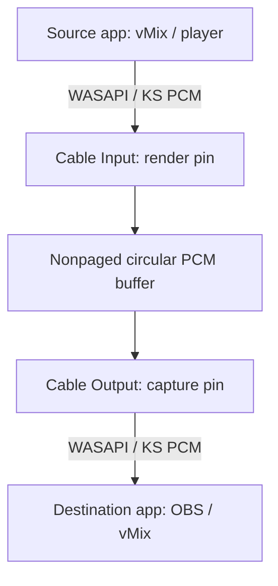

# Santtos Virtual Cable — Engineering Specification

## 1. Product boundary

The product is one local virtual cable. An application renders PCM to
`Santtos Cable Input`; another application captures the identical frames from
`Santtos Cable Output`. There is no encoder, decoder, network stack, mixer,
sample-rate converter, limiter, AGC or noise reduction in the real-time path.

## 2. Why PCM instead of 380 kbit/s

A bitrate such as 380/384 kbit/s describes a compressed stream. Compression is
useful over a network, but inside one computer it adds latency and can alter the
signal. The default stream is:

`48,000 samples/s × 2 channels × 32 bits = 3,072,000 bits/s`

IEEE float keeps headroom through professional software and avoids needless
format conversion when vMix or OBS uses float internally. Integer 16/24-bit
formats remain available for compatibility.

## 3. Driver architecture

Use the Microsoft SysVAD sample as the WDM/PortCls starting point, reduced to a
single paired WaveRT render/capture topology.

### Real-time rules

- Allocate all buffers before `RUN`; no allocation in the streaming path.
- Single producer/single consumer indices use acquire/release semantics.
- Audio samples are copied exactly once into and once out of nonpaged memory.
- No locks, logging, UI IPC or file access at real-time priority.
- Frame-aligned writes only; never expose a partial multichannel frame.
- On underrun, return zeroed frames and increment a 64-bit counter.
- On overflow, retain queued frames, reject only the incoming complete frames
  that do not fit and increment a 64-bit counter. The producer never moves the
  consumer cursor. This preserves lock-free SPSC ownership and prevents a data
  race. The panel can offer an explicit resync outside the real-time callback.
- Reset indices and clock correlation atomically on stop/restart.

### Clocking

The render side is the clock master while active. Capture position is derived
from the same monotonic frame counter. If capture starts without a producer, it
returns silence while advancing at the negotiated sample clock. QPC correlation
is exposed for stable position/timestamp reporting.

### Supported formats

| Sample rate | Channels | Formats | Purpose |
|---:|---:|---|---|
| 48 kHz | 2 | PCM16, PCM24-in-32, Float32 | Broadcast/default |
| 96 kHz | 2 | PCM24-in-32, Float32 | Optional studio use |

Version 1 intentionally avoids arbitrary rates and channel counts. Every extra
format increases Windows Audio Engine conversion opportunities and the test
matrix. Multichannel cables can be added after stereo is proven stable.

## 4. Buffer policy

The driver declares mode-specific WaveRT packet constraints and exposes these
48 kHz periods:

- 48 frames (1 ms): Ultra
- 96 frames (2 ms): Live/default
- 144 frames (3 ms): Balanced
- 240 frames (5 ms): Safe
- 480 frames (10 ms): Compatible

The physical ring capacity is separate from the processing period. Start with
2,048 stereo frames so a temporary scheduling spike can be absorbed without
forcing the normal path to carry that much latency. The initial read cursor is
primed by exactly two selected periods.

Do not label 1 ms as universally “better.” The panel recommends the smallest
period that records zero discontinuities during a 10-minute stress test.

## 5. Control panel improvements

The panel is not required for audio to continue. It communicates with the
driver only for configuration and telemetry.

- Large dual peak/RMS meters with clip hold
- Current format, active clients and measured buffer fill
- Exact estimated cable latency in milliseconds and frames
- Underrun, overflow and discontinuity counters
- One-click `vMix + OBS (48 kHz)` profile
- Ultra/Live/Safe/Compatible presets with plain-language risk descriptions
- Format-mismatch warning before Windows silently resamples
- Diagnostic export with no captured audio or personal data
- Tray status icon and automatic recovery after sleep/device restart
- Changes requiring stream restart are staged, clearly identified and applied
  only after confirmation

## 6. Weaknesses addressed

| Common virtual-cable weakness | Product response |
|---|---|
| Sample-rate mismatches cause resampling or failures | 48 kHz default, active mismatch warning |
| Latency control is expressed as opaque buffer values | Named modes plus frames and milliseconds |
| Users trade stability for latency without evidence | 10-minute stress test and glitch counters |
| Little visibility into silence/clicks | Fill level, active clients, underrun/overflow counters |
| Processing can silently color the signal | RAW mode; no APO/DSP in cable path |
| Settings are scattered across legacy dialogs | Single Portuguese control panel |
| Very small buffers fail under DPC spikes | Safe fallback recommendation, no automatic hidden change |

## 7. Acceptance tests

### Bit-exact and signal tests

1. Float32 pseudo-random frames input/output compare bit-for-bit.
2. PCM16 and PCM24 ramps verify sign extension and frame alignment.
3. 20 Hz–20 kHz sweep confirms flat response (difference exactly zero without
   Windows conversion).
4. Digital silence confirms no DC offset, noise or denormal generation.
5. Channel identity test confirms no swap or crosstalk.

### Latency and robustness

1. Measure 10,000 impulse round trips and report p50/p95/p99, not one sample.
2. Run 8 hours in Live mode with OBS recording and vMix rendering.
3. Stress CPU/GPU/storage concurrently; require zero corruption and report all
   discontinuities.
4. Repeatedly start/stop either endpoint and suspend/resume Windows.
5. Verify producer-first, consumer-first and multiple-open rejection behavior.
6. Test 44.1 kHz client requests and show an actionable mismatch message.

### Release gates

- No kernel crash or Driver Verifier failure.
- Zero sample mutation in same-format tests.
- Zero silent buffer-policy changes.
- Live mode p99 cable latency at or below 6 ms on the reference PC.
- 8-hour clean run on the reference broadcast workload.

## 8. Build and release constraints

Development uses Visual Studio, Windows SDK and WDK. Test builds can be loaded
on a dedicated Windows test machine with test signing. A normal installer for
other PCs requires a signed driver package; do not ask operators to disable
Windows security features for production use.
